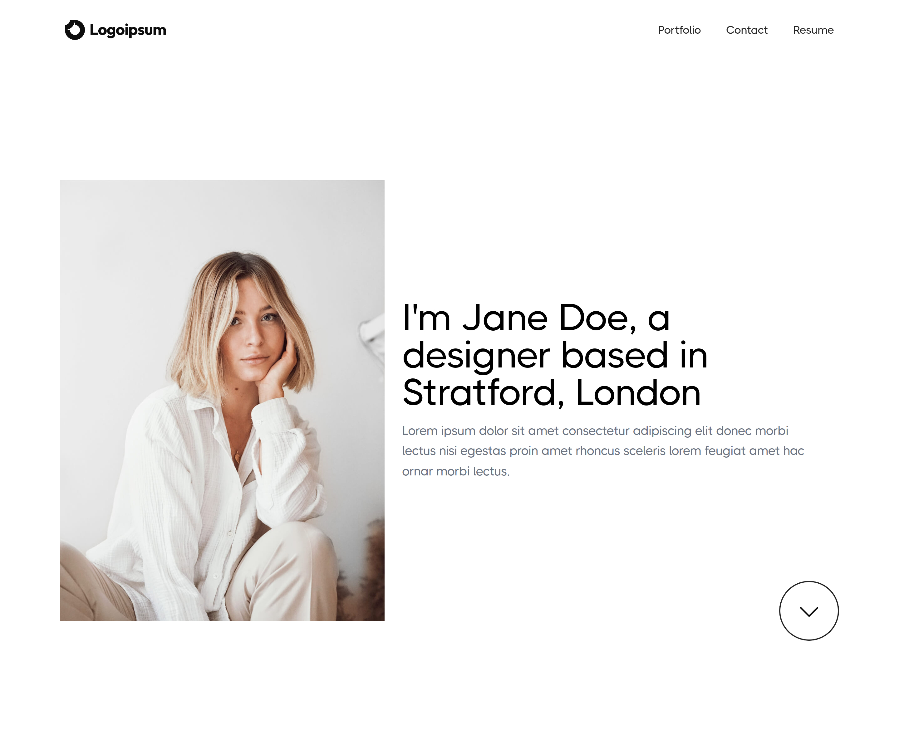

### Portfolio template with Vite and React

**Preview**



**Features** 

- 🥰 Minimal and light
- 📱 Responsive
- 🌗 Light/dark/system color modes

## Setup

Make sure to install the dependencies:

```bash
# yarn
yarn install

# npm
npm install
```

## Development Server

Start the development server on http://localhost:5173

```bash
npm run dev
```

## Production

Build the application for production:

```bash
npm run build
```

Locally preview production build:

```bash
npm run preview
```